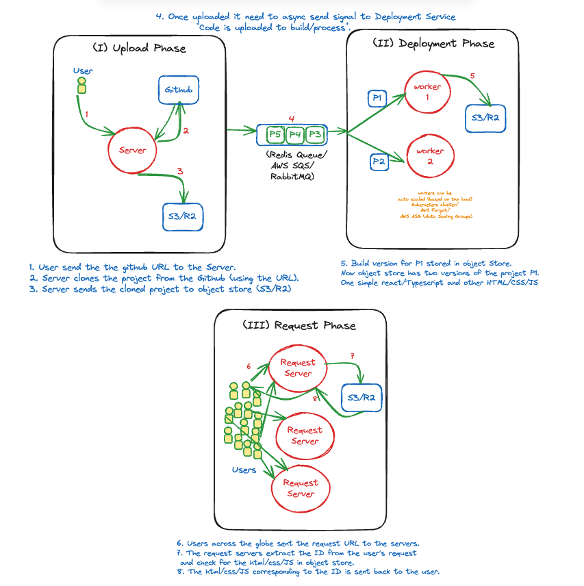

# Vercel-clone

Reference link to [vercel](https://vercel.com/)
### How would you explain Vercel in one line? 
It takes link to your github project and deploy it on the internet. Making developers like quite easy, right?

### Wait what does that mean end-to-end project? like DB, backend etc. etc.
Well yes, vercel does that but this vercel-clone doesn't. In this one we only take care of the gist of Vercel like only deploying lightweight projects.

## Technology Stack Used:
1. NodeJS
2. TypeScript
3. ExpressJS
4. ReactJS
5. Redis (Queue)
6. Object Store (AWS S3 or Cloudflare R2)

## System Design:

###### Note: This project is part of my learning journey and thanks to the online tutorials, creators and stackoverflow community for such great content.
